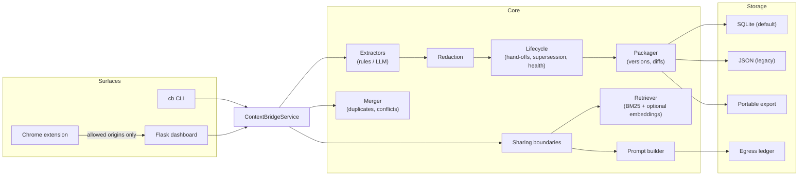

<p align="center">
  <h1 align="center">🌉 ContextBridge</h1>
  <p align="center"><strong>Portable, privacy-conscious working memory for people who move between ChatGPT, Claude, and local models.</strong></p>
  <p align="center">Extract structured memory from a conversation, review and redact it, retrieve only what the next task needs, and paste it into any model — with every selection explained.</p>
</p>

<p align="center">
  <a href="https://github.com/TirthPatel6104/ContextBridge/actions/workflows/ci.yml"></a>
  
  
  
  
</p>

---

## The problem

You spend an afternoon in ChatGPT designing a database schema. The next morning you open Claude to write the migration, and it knows nothing: not your name, not the stack, not the three decisions you already argued through, not the two tasks still open. So you re-explain — badly, from memory, burning tokens on a wall of pasted chat that is mostly noise.

Every AI tool keeps its own memory, none of them share it, and none of them let you see or edit what they remember. Pasting whole transcripts is the workaround, and it leaks secrets, wastes context windows, and still loses the thread.

## What ContextBridge does

ContextBridge turns a conversation into **reviewable, portable, structured memory** that you own:

| Step | What happens | Why it matters |
|---|---|---|
| **1. Import** | A transcript, ChatGPT export ZIP, saved page, PDF, or Markdown is parsed locally and decomposed into six categories: identity, projects, facts, decisions, open tasks, preferences. Works fully offline with a rule-based extractor, or with an LLM when you want quality over privacy. | Memory becomes data with a schema, not a blob. |
| **2. Review & redact** | Every item shows its confidence, the source excerpt it came from, and where it came from. Secrets and personal data are masked before storage, transparently. You remove what is wrong; removals are versioned and reversible. | You see and control exactly what will be carried forward. |
| **3. Retrieve** | Type what you are about to do. Items are scored, and the result shows *which* were selected, their scores, the matched terms, and the estimated tokens saved compared with the full memory or the raw transcript. Tune top-k, categories, minimum score, and a token budget. | No black-box retrieval; no wasted context window. |
| **4. Export** | The selection is rendered the way the target model prefers (XML for Claude, Markdown for ChatGPT, plain text for Ollama) with a provenance footer, ready to paste. Items you marked *local only* are withheld from cloud targets and listed, and the build is written to the **egress ledger**. Packages export to a single portable JSON file. | Continuity across tools without vendor lock-in, and no silent leaks. |
| **✓ Ledger & health** | See which item ids went to which model and when, which items have never left the machine, which are corroborated by several conversations, which have gone stale, and which new statements may contradict what you already hold. | Memory you can audit and keep true, not just accumulate. |

Plus **merging**: combine several conversations into one working memory. Near-duplicates are folded with their origins preserved; statements that *might* conflict ("deadline is Q3" vs "deadline is Q4") are flagged and both kept for you to decide.

Everything runs on `127.0.0.1`. The only time a transcript leaves your machine is when you explicitly choose a vendor extraction engine. See [docs/PRIVACY.md](docs/PRIVACY.md).

### What is different from ChatGPT Memory, Claude Projects, or a memory SDK

| | Vendor memory (ChatGPT, Claude) | Memory SDKs (Mem0, Zep, Letta) | ContextBridge |
|---|---|---|---|
| Works across vendors | No | Yes, for the app you build | Yes, for you, with no code |
| Runs without an API key | n/a | Usually hosted | Yes, offline by default |
| Per-item **sharing boundary** (this fact may go to a local model but never to a cloud one) | No | No | **Yes** — `any` / `local_only` / `never`, enforced on every prompt build |
| **Egress ledger** (which memory went to which model, when) | No | No | **Yes** — item ids, target, surface, tokens; never the text |
| Contradictions **flagged, not overwritten** | Overwrites silently | Varies | **Yes** — old item kept as *superseded* with a pointer to its replacement |
| Corroboration (how many conversations restated a fact) | No | No | **Yes** — `seen ×N`, first / last seen, stale-item report |
| **Hand-off aware** (importing the chat you started from a prompt does not re-import the prompt) | n/a | No | **Yes** — the pasted block is recognised, skipped, and linked back |
| Retrieval you can inspect (scores, matched terms, withheld items) | No | Partly | Yes |

The honest trade-off: vendor memory is zero-effort inside its own walls, and ContextBridge's default extractor is rule-based and its offline retrieval is lexical. See the [roadmap](#roadmap).

### Who it is for

* **Developers** carrying architecture decisions and open TODOs between a coding assistant and a chat model.
* **Researchers and students** keeping experiment constraints, citation preferences, and reading notes consistent across tools.
* **Knowledge workers** who plan in one assistant and draft in another and are tired of re-briefing.

## Quick start

```bash
git clone https://github.com/TirthPatel6104/ContextBridge.git
cd ContextBridge
python -m venv .venv && . .venv/bin/activate      # Windows: .venv\Scripts\activate
pip install -e ".[dev,web]"
```

No API keys are needed for the default workflow.

```bash
# 1. Import a conversation (offline rule-based extraction, redaction on)
cb import experiments/sample_chat.txt -o contextbridge_design

# 2. Review what was extracted (ids let you remove items)
cb inspect contextbridge_design --ids

# 3. See exactly which items a task would pull in, and why
cb retrieve contextbridge_design "vector search decisions" --top-k 3

# 4. Get a paste-ready prompt for the next model, scoped to that task
cb prompt contextbridge_design --model claude --query "vector search decisions" --copy

# 5. Keep one item away from cloud models, then see what each model has received
cb share contextbridge_design <ITEM_ID> --policy local_only
cb prompt contextbridge_design --model claude       # that item is withheld and listed
cb audit contextbridge_design                        # the egress ledger
cb health contextbridge_design                       # stale items, open tasks, conflicts
```

Then start the dashboard for the same workflow with a UI:

```bash
python -m contextbridge.web.app        # → http://127.0.0.1:5000
```

### Demo walkthrough (dashboard)

1. Drop `experiments/sample_chat.txt` on **step 1**, keep *Redact secrets* on, click **Extract memory**. The result shows how many items were extracted and what, if anything, was redacted.
2. **Step 2** loads the package: each item has a category chip, a confidence bar, its source excerpt, and its origin. Tick a wrong item and click **Remove selected** — the history table gains a new version with a roll-back button.
3. In **step 3** type `vector search` and click **Preview retrieval**. Each selected item shows its score, the matched terms, and a one-line reason; the stat row shows estimated tokens in the selection versus the full memory and the transcript.
4. In **step 4** choose *Claude*, scope *Only the retrieval selection*, click **Generate prompt**, then **Copy**. Paste it as your first message in Claude.
5. Back in **step 2**, tick an item, set *Sharing* to *local models only* and click **Apply sharing**. Generate the Claude prompt again: the item is withheld and listed; generate it for the local model and it is back.
6. The **Ledger & health** section now shows both builds: target, kind (cloud / local), items sent, items withheld, and which items have ever reached a cloud model.
7. Save the Claude chat and import it into the same package. The import reports a *hand-off*: the pasted context is skipped, only what Claude and you added is extracted, and any new statement that contradicts stored memory appears as a pending conflict with *New replaces stored* / *Stored stays* / *Both stand* buttons.
8. Import a second transcript under another name, then use **Merge packages** with *Preview merge* to see folded duplicates and flagged conflicts before saving.

Screenshots and a GIF belong in [docs/screenshots/](docs/screenshots/README.md) (placeholders describe what to capture).

## Three surfaces, one engine

| Surface | Use it for |
|---|---|
| **`cb` CLI** | Scripted or terminal workflows: import, retrieve, prompt, share, done, supersede, conflicts, audit, health, merge, export/import package files, evaluation |
| **Dashboard** (`127.0.0.1:5000`) | The guided import → review → retrieve → export workflow, the ledger & health panel, package tools, and the evaluation panel |
| **Chrome extension** | A floating button on chatgpt.com / claude.ai that sends the open conversation to your local server and hands back a prompt for the other model |

All three call the same `ContextBridgeService`, so behaviour is identical.

## Architecture



Design notes, the data model, and the storage schema are in [docs/ARCHITECTURE.md](docs/ARCHITECTURE.md).

### Data model in one glance

```json
{
  "name": "contextbridge_design",
  "version": 3,
  "schema_version": 3,
  "memory": {
    "decisions": [
      {
        "id": "9c1f3e2a7b4d",
        "category": "decisions",
        "content": "Using Pydantic for data models and FAISS for vector search",
        "confidence": 0.7,
        "source": "rule:decision_keyword",
        "origin": "sample_chat.txt | claude_followup.txt",
        "redactions": [],
        "sharing": "any",
        "status": "superseded",
        "superseded_by": "4d1e0a9c77b2",
        "first_seen": "2026-09-10T09:12:00Z",
        "last_seen": "2026-09-14T18:40:00Z",
        "seen_count": 2
      }
    ]
  },
  "history": [
    {"version": 1, "note": "created", "diff": {"added": ["…"], "removed": [], "modified": []}},
    {"version": 2, "note": "imported", "diff": {"added": ["…"], "removed": [], "modified": []}},
    {"version": 3, "note": "9c1f3e2a7b4d superseded by 4d1e0a9c77b2", "diff": {"added": [], "removed": [], "modified": [{"id": "9c1f3e2a7b4d", "before": {"status": "active"}, "after": {"status": "superseded"}}]}}
  ],
  "metadata": {
    "handoffs": [{"package_name": "contextbridge_design", "package_version": 1, "origin": "claude_followup.txt"}]
  }
}
```

Item ids are derived from category + normalised content, so the same statement gets the same id across re-extractions, diffs, and merges. Status and sharing changes are recorded as `modified` entries so a rollback restores them. The egress ledger lives next to the package (a table in SQLite, a `.jsonl` file per package in the JSON backend) and stores item ids, never text.

## Privacy model

* **Local-first by default.** Storage is a SQLite file under `~/.contextbridge`. The dashboard loads no external fonts or scripts and binds to loopback. CORS is limited to the chat sites the extension runs on.
* **Redaction before storage.** API keys, tokens, JWTs, private keys, credential assignments, card numbers, SSNs, emails, phone numbers, and IP addresses are replaced with `[REDACTED:KIND]` placeholders. The item records only the kind and count. You see the report; your original files are never modified; you can opt out per import.
* **Nothing is logged that you would not want in a log.** Counts and package names, yes; transcript text, memory content, prompts, and keys, no.
* **Explicit egress only.** Choosing `openai` or `claude` as an extraction engine sends the transcript to that vendor. `cb query` sends the question and selected memory to the model you name. Nothing else leaves the machine.
* **Sharing boundaries per item.** Mark an item `local_only` and it is rendered for Ollama but withheld from ChatGPT and Claude; mark it `never` and it stays in your memory without ever entering a prompt. Every prompt build lists what was withheld and why. An unknown target name is treated as cloud.
* **An egress ledger you can read.** Every prompt build and `cb query` records the target, its kind, which surface asked (CLI, dashboard, extension), the item ids, and token count. `cb audit` and the dashboard show which items have ever reached a cloud model and which never left. Preview builds (`--dry-run`, or the checkbox off) are not recorded.

Full details: [docs/PRIVACY.md](docs/PRIVACY.md).

## Memory that stays true

Memory that only accumulates becomes wrong. ContextBridge tracks each item's life:

* **Corroboration.** Re-importing a statement bumps `seen_count` and `last_seen` and appends the new origin instead of creating a duplicate. `cb health` separates well-corroborated items from single sightings and lists what has not been seen for a while.
* **Supersession, not overwriting.** When an import contains a statement that may contradict an active stored one (same subject, different wording, often with "instead", "switch", "no longer"), it is flagged as a *pending conflict*. You choose *keep new*, *keep old*, or *both stand*; the losing item is kept as `superseded` with a pointer to its replacement, leaves prompts and retrieval, and can be reactivated or rolled back.
* **Done tasks.** `cb done` retires an open task without deleting it; `cb reopen` brings it back.
* **Hand-off detection.** A chat that started from a ContextBridge prompt carries the provenance footer. On import, the pasted block is recognised and skipped, so the package never re-ingests an echo of itself, and the link back to the source package and version is recorded.

## How it evaluates itself

`cb eval` runs an offline suite over bundled fixtures (three labelled transcripts, duplicate pairs, redaction samples). No API calls, deterministic, about a second.

| Metric (v0.3.0) | Value |
|---|---|
| Extraction coverage (rule-based extractor) | 100.0% |
| Retrieval precision@3 / recall@3 / MRR | 76.7% / 93.3% / 86.7% |
| Duplicate detection F1 | 75.0% |
| Redaction recall / false positives | 100.0% / 0 |
| Token savings vs. transcript / vs. full memory | 93.2% / 81.5% |

These numbers describe the offline components on friendly fixtures. Extraction coverage is high *because* the fixtures use explicit phrasing the rules understand; the duplicate score is deliberately conservative (false negatives become flagged conflicts rather than silent merges); one retrieval query fails for the textbook lexical reason (no shared vocabulary). [docs/EVALUATION.md](docs/EVALUATION.md) explains each metric, the misses, and how to add fixtures.

## Configuration

Copy `.env.example` to `.env`. Everything is optional.

| Variable | Default | Purpose |
|---|---|---|
| `CB_STORAGE_DIR` | `~/.contextbridge` | Where packages live |
| `CB_STORAGE_BACKEND` | `sqlite` | `sqlite` or `json` (legacy per-version files) |
| `CB_REDACT` | `true` | Redact secrets/PII before storing |
| `CB_DEFAULT_ADAPTER` | `local` | Default extraction engine |
| `CB_HOST` / `CB_PORT` | `127.0.0.1` / `5000` | Dashboard bind address |
| `CB_ALLOWED_ORIGINS` | chatgpt.com, chat.openai.com, claude.ai | Browser origins allowed to call the API |
| `CB_MAX_UPLOAD_MB` | `25` | Upload size limit |
| `OPENAI_API_KEY`, `ANTHROPIC_API_KEY` | — | Only for the matching engine / query target |

Extraction engines: `local` (offline rules), `openai`, `claude`, or any Ollama model name (e.g. `--engine llama3`).

## CLI reference

| Command | What it does |
|---|---|
| `cb import FILES… -o NAME [--engine E] [--no-redact] [--mode append\|replace]` | Extract memory from transcripts / exports / PDFs / Markdown |
| `cb retrieve NAME "query" [-k N] [-c category]… [--budget T] [--min-score S] [--json]` | Explainable retrieval with token savings |
| `cb prompt NAME --model claude\|openai\|local [-q "query"] [--copy] [--raw] [--dry-run]` | Paste-ready prompt, optionally scoped by retrieval; withheld items listed; recorded in the ledger unless `--dry-run` |
| `cb query "question" -c NAME -m MODEL` | Ask a model with relevant memory injected (calls the API; recorded in the ledger) |
| `cb list` / `cb inspect NAME [--ids]` / `cb history NAME` | Browse packages, items (with status, sharing, sightings), and versions |
| `cb remove NAME ID…` / `cb rollback NAME -v N` / `cb delete NAME` | Curate and undo |
| `cb share NAME ID… --policy any\|local_only\|never` | Who may see an item when a prompt is built |
| `cb done NAME ID…` / `cb reopen NAME ID…` / `cb supersede NAME OLD NEW` | Lifecycle: retire tasks, reactivate, record replacements |
| `cb conflicts NAME [--resolve OLD NEW keep_new\|keep_old\|dismiss]` | Review and settle statements that may contradict stored memory |
| `cb audit NAME [--json] [--clear]` | Egress ledger: which items went to which model, when, via which surface |
| `cb health NAME [--stale-days N] [--json]` | Stale items, open tasks, corroboration, exposure, pending conflicts |
| `cb export-package NAME [-o FILE]` / `cb import-package FILE [--name N] [--overwrite]` | Portable JSON files |
| `cb merge A B… -o NEW [--dry-run]` | Merge with duplicate folding and conflict flags |
| `cb scan FILES…` | Preview what redaction would mask, without storing anything |
| `cb eval [--json]` | Offline evaluation suite |
| `cb info` / `cb migrate` | Storage details; import legacy JSON packages into SQLite |

`cb export` and `cb web-export` remain as aliases from 0.1.

## Chrome extension

1. Start the dashboard (the extension talks to `localhost:5000`).
2. `chrome://extensions` → *Developer mode* → *Load unpacked* → select `extension/`.
3. On chatgpt.com or claude.ai, click the floating button, name the package, and click **Extract this chat**. The status line reports how many items were extracted and what was redacted. **Copy prompt** gives you the prompt for the other model, tells you how many items were withheld by their sharing policy, and records the build in the ledger as surface `extension`; files you attach in the panel are included because you attached them, nothing else is.

## Development

```bash
pytest -q                              # 244 tests, all offline (mock adapter, temp SQLite)
ruff check contextbridge tests         # lint
ruff format --check contextbridge tests
cb eval                                # evaluation suite
```

CI runs all four on Python 3.11, 3.12, and 3.13.

Project layout:

```
contextbridge/
├── models.py            # Pydantic schema: MemoryItem (id, origin, redactions, sharing, status, sightings), ContextPackage, EgressRecord
├── config.py            # Settings from CB_* env vars
├── validation.py        # Package names, file names, sizes
├── service.py           # ContextBridgeService: the one place the pieces are wired
├── cli.py               # Click CLI
├── core/                # extractors, redaction, lifecycle, sharing, packager, retriever, merger, prompt_builder, tokens
├── adapters/            # OpenAI, Claude, Ollama (LLMInterface)
├── storage/             # SQLiteStore, JSONStore (both with the egress ledger), portable export/import, VectorStore
├── evaluation/          # runner + fixtures
└── web/                 # Flask app factory, templates, static
extension/               # Chrome MV3 content script
tests/                   # 244 tests
docs/                    # ARCHITECTURE, PRIVACY, EVALUATION, screenshots
```

## Upgrading

**From 0.2** — nothing to do. Existing items load with `sharing: any`, `status: active`, and `seen_count: 1`; their `first_seen` / `last_seen` are set when the package is first loaded, so the stale-item report is only meaningful for imports made after the upgrade. The egress ledger starts empty. The SQLite schema gains one table on first open.

**From 0.1** — nothing to do for most users. On first run the SQLite backend imports every JSON package (all versions) from `~/.contextbridge` and leaves the JSON files in place. `cb migrate` runs the same import explicitly and reports what it did; `cb info` shows where data lives. `CB_STORAGE_BACKEND=json` keeps the old behaviour. Note that `--engine local` / `--model local` for *extraction* now means the offline rule-based extractor everywhere (the dashboard already worked this way); use an Ollama model name for local LLM extraction. Details in [CHANGELOG.md](CHANGELOG.md).

## Roadmap

Implemented in 0.3.0:

- [x] Per-item sharing boundaries (`any` / `local_only` / `never`) enforced on every prompt build, with withheld items listed
- [x] Egress ledger: which item ids went to which model, when, via which surface; audit and clear from CLI and dashboard
- [x] Item lifecycle: supersession with pointers, done tasks, reactivation, all versioned and reversible
- [x] Import-time contradiction detection with keep-new / keep-old / both-stand resolution
- [x] Corroboration tracking (sightings, first / last seen, merged origins) and a stale-item health report
- [x] Hand-off detection: pasted ContextBridge prompts are skipped on re-import and linked back

Implemented in 0.2.0:

- [x] SQLite storage with automatic, non-destructive migration from JSON
- [x] Portable package export/import
- [x] Explainable retrieval: scores, matched terms, reasons, category filters, top-k, token budgets, token-savings estimates
- [x] Secrets/PII redaction with transparent reporting
- [x] Multi-package merge with duplicate folding and conflict flags
- [x] Review workflow with per-item provenance, versioned removals, rollback
- [x] Offline evaluation suite wired into CLI, API, dashboard, and CI
- [x] Input validation, restricted CORS, loopback binding, no content in logs

Planned (not yet implemented):

- [ ] Recorded-fixture evaluation of LLM extractors (grade saved outputs offline)
- [ ] Local semantic embeddings (e.g. a small sentence-transformer) so the offline path is not purely lexical
- [ ] Item editing in the review step (currently: remove, re-import, or merge)
- [ ] Streaming / chunked extraction for very long transcripts
- [ ] Extension: select which items to include before copying
- [ ] Automatic "task looks finished" suggestions from later transcripts (today: `cb done` is manual)
- [ ] Default sharing policy rules (e.g. every item with a redaction starts as `local_only`)

## License

MIT — see [LICENSE](LICENSE).
