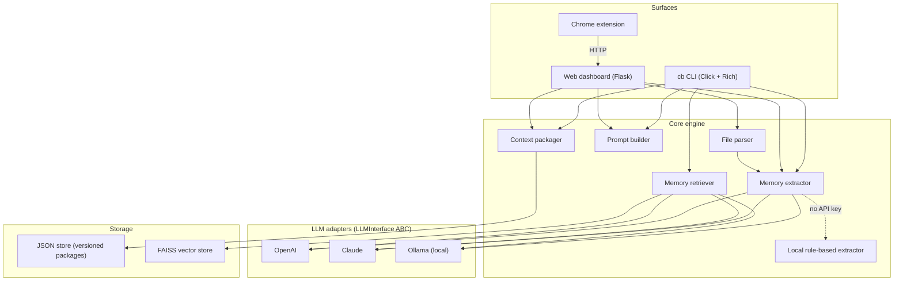

<p align="center">
  <h1 align="center">🌉 ContextBridge</h1>
  <p align="center">
    <strong>A cross-model conversational memory system for LLMs</strong>
  </p>
  <p align="center">
    Extract structured memory from a conversation with one model, version it, and inject only the relevant parts into another — GPT, Claude, or a local Ollama model.
  </p>
</p>

<p align="center">
  <a href="https://github.com/TirthPatel6104/ContextBridge/actions/workflows/ci.yml"></a>
  
  
  
</p>

---

## The problem

Switch from ChatGPT to Claude (or to a local LLaMA) mid-project and everything the previous model knew about you is gone: who you are, what you're building, the decisions you already made, the tasks still open. You re-explain from scratch, burn tokens, and lose continuity.

## The solution

ContextBridge treats conversational context as **data with a schema**, not as a blob of chat history:

1. **Extract** — an LLM (or an offline rule-based extractor) turns a transcript into six typed memory categories.
2. **Package** — memory is stored as a versioned *context package* with a full diff history and rollback.
3. **Retrieve** — on a new query, only the semantically relevant memory items are pulled back via FAISS vector search.
4. **Inject** — the prompt is rendered in the target model's preferred format (XML for Claude, Markdown for GPT, plain text for local models).

```
┌─────────────┐     ┌───────────────┐     ┌──────────────┐
│  GPT chat   │────▶│ ContextBridge │────▶│ Claude chat  │
│  (source)   │     │ memory layer  │     │ (target)     │
└─────────────┘     └───────────────┘     └──────────────┘
```

## Three ways to use it

| Surface | What it's for |
|---|---|
| **`cb` CLI** | Scripted workflows: export, query, inspect, history, rollback, paste-ready prompts |
| **Web dashboard** (`localhost:5000`) | Drag-and-drop ChatGPT export ZIPs, PDFs, Markdown, or transcripts; manage packages; attach reference files |
| **Chrome extension** | A floating button on chatgpt.com / claude.ai that scrapes the open conversation, sends it to the local server, and hands you a paste-ready prompt for the *other* model |

## Architecture



### Structured memory

Every conversation is decomposed into six categories, each item carrying a confidence score and the source quote it came from:

| Category | Captures |
|---|---|
| **Identity** | Name, role, background |
| **Projects** | What's being built, tech stack |
| **Facts** | Constraints, requirements |
| **Decisions** | Architectural choices already made |
| **Open tasks** | Pending TODOs, next steps |
| **Preferences** | Code style, tooling, communication style |

Extraction runs through whichever LLM adapter you choose. With no API key at all, a **rule-based local extractor** (regex + heuristics) still produces usable memory — less accurate, zero dependencies.

### Retrieval-augmented memory

Rather than injecting the whole package, memory items are embedded and stored in FAISS. A query is embedded, the top-*k* most similar items are selected, and only those go into the prompt.

```
query ──▶ embed ──▶ FAISS similarity search ──▶ top-k items ──▶ targeted prompt
```

Claude has no embedding API, so a deterministic hash-based embedding fallback keeps the retriever working without a hard dependency on OpenAI.

### Versioned context packages

Every update produces a new version with a computed diff (`added` / `removed`) and a timestamp. `cb rollback` restores any earlier version without losing history.

```json
{
  "name": "my_project",
  "version": 3,
  "source_model": "claude",
  "memory": { "identity": [...], "projects": [...], "decisions": [...] },
  "history": [
    { "version": 1, "diff": {}, "timestamp": "..." },
    { "version": 2, "diff": { "added": [...], "removed": [...] }, "timestamp": "..." }
  ]
}
```

### Model-adaptive prompt formatting

The same package renders differently per target:

- **Claude** → `<context><identity>…</identity><decisions>…</decisions></context>` (XML tags)
- **GPT** → `## User Identity` / `- …` (Markdown)
- **Local models** → plain text with numbered lists

### Input formats

The file parser accepts ChatGPT export ZIPs (`conversations.json`), `.txt` transcripts, `.md`, `.pdf` (via PyPDF2), `.json`, and saved `.html` pages.

## Installation

```bash
git clone https://github.com/TirthPatel6104/ContextBridge.git
cd ContextBridge
pip install -e ".[dev]"        # core + test tooling
pip install -e ".[web]"        # add Flask dashboard + PDF parsing
```

Copy `.env.example` to `.env` and add keys for whichever adapters you want:

```bash
OPENAI_API_KEY=sk-...
ANTHROPIC_API_KEY=sk-ant-...
CB_DEFAULT_ADAPTER=openai      # openai | claude | local
CB_STORAGE_DIR=                # default: ~/.contextbridge
```

The `local` adapter talks to Ollama at `http://localhost:11434` and needs no key.

## Quick start (CLI)

```bash
# 1. Extract structured memory from a transcript (GPT does the extraction)
cb export --model openai --chat conversation.txt --output my_project

# 2. Ask a question on a different model, with only the relevant memory injected
cb query "continue the system design" --context my_project --model claude

# 3. Generate a paste-ready prompt for the web UI of ChatGPT / Claude
cb prompt my_project --model claude --copy

# 4. Inspect, audit, and roll back
cb inspect my_project
cb history my_project
cb rollback my_project --version 1
```

| Command | Description |
|---|---|
| `cb export` | Extract structured context from a chat transcript |
| `cb web-export` | Same, but reads from stdin (paste mode) and targets a specific model |
| `cb query` | Ask a question with relevant context injected (`--smart` enables retrieval filtering) |
| `cb prompt` | Render a paste-ready prompt for a target model; `--copy` puts it on the clipboard |
| `cb list` / `cb inspect` | List packages / view one |
| `cb history` | Show version history with diffs |
| `cb rollback` | Restore a previous version |
| `cb delete` | Delete a package |

## Web dashboard

```bash
pip install -e ".[web]"
python -m contextbridge.web.app      # → http://localhost:5000
```

Drop a ChatGPT export ZIP, a PDF, or a transcript on the page; pick a source and target model; get a prompt back. Packages, attached files, and a watch folder (`~/.contextbridge/watch`) are managed from the same UI. Available Ollama models are listed automatically.

## Chrome extension

1. Start the web dashboard (the extension talks to `localhost:5000`).
2. `chrome://extensions` → enable *Developer mode* → *Load unpacked* → select the `extension/` folder.
3. Open a conversation on chatgpt.com or claude.ai and click the floating ContextBridge button.

The content script scrapes the visible conversation from the DOM, posts it to `/api/extract`, and shows a paste-ready prompt formatted for the *other* model.

## Project structure

```
contextbridge/
├── models.py              # Pydantic models: MemoryItem, StructuredMemory, ContextPackage
├── cli.py                 # Click CLI with Rich output
├── core/
│   ├── llm_interface.py   # Abstract LLM contract (send / embed)
│   ├── memory.py          # LLM-powered structured memory extractor
│   ├── local_extractor.py # Offline rule-based extractor (no API key)
│   ├── file_parser.py     # ZIP / TXT / MD / PDF / JSON / HTML → text
│   ├── packager.py        # Versioned packages, diffs, rollback
│   ├── prompt_builder.py  # Model-adaptive prompt formatting
│   └── retriever.py       # Semantic retrieval over memory items
├── adapters/
│   ├── openai_adapter.py
│   ├── claude_adapter.py
│   └── local_adapter.py   # Ollama
├── storage/
│   ├── base.py            # Storage interface
│   ├── json_store.py      # File-based package store
│   └── vector_store.py    # FAISS index
└── web/                   # Flask dashboard (app.py, templates/, static/)
extension/                 # Chrome MV3 extension (content script + widget)
tests/                     # 41 tests, all against a mock adapter — no API keys needed
experiments/               # Sample transcripts
```

## Development

```bash
pytest -q                          # 41 tests
ruff check contextbridge tests
```

CI runs lint + tests on Python 3.11 and 3.12.

## Design decisions

| Decision | Why |
|---|---|
| Pydantic models for everything | Validation, typing, and JSON round-tripping for free |
| Abstract `LLMInterface` + adapters | Swap providers without touching core logic; tests run against a mock |
| FAISS for retrieval | Fast local similarity search, no external service |
| Hash-based embedding fallback | Claude has no embedding API; keeps retrieval working without OpenAI |
| Versioned packages with diffs | Full audit trail; rollback never destroys data |
| Per-model prompt formatting | Each model family responds better to its own conventions |
| Rule-based extractor | A working offline path when no LLM is available |

## Status and roadmap

This is an alpha (v0.1). The core loop — extract → package → retrieve → inject — works end to end across the CLI, dashboard, and extension.

- [x] OpenAI, Claude, and Ollama adapters
- [x] Web dashboard with file upload
- [x] Chrome extension for chatgpt.com / claude.ai
- [ ] Quantitative evaluation: token savings, context recall, retrieval precision, cross-model consistency
- [ ] SQLite storage backend
- [ ] Multi-conversation merging
- [ ] Streaming extraction for long transcripts

## License

MIT — see [LICENSE](LICENSE).
