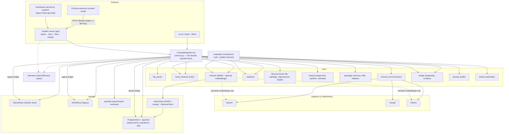

# Architecture

ContextBridge treats conversational context as **data with a schema** rather than a blob of chat history. This document describes the moving parts, the data model, and the decisions behind them.

## Overview



### Layers

| Layer | Responsibility | Key rule |
|---|---|---|
| **Surfaces** (`cli.py`, `api/`, `web/`, `extension/`) | Parse input, render output | No business logic; everything goes through the service |
| **Service** (`service.py`) | Orchestrates extraction → redaction → packaging → storage → retrieval → prompt | Takes the store and settings by injection; no module-level state |
| **Core** (`core/`) | Pure domain logic | No I/O except through the adapter interface; deterministic where possible |
| **Adapters** (`adapters/`) | Vendor SDK calls | Implement `LLMInterface`; declare whether embeddings are semantic |
| **Storage** (`storage/`) | Persistence | Validate names before touching disk or database; never delete history |
| **Telemetry** (`telemetry.py`) | Optional tracing | No-op without the SDK; attributes carry counts and names, never content |

The FastAPI app is created by `contextbridge.api.create_app(settings, store=…, service=…)`, the Flask dashboard by `web.create_app(...)`, and the CLI builds a per-invocation `Context`. Tests inject a temporary SQLite store and a mock adapter, so the full workflow runs without network access; the Postgres tests run against a throw-away schema when `CB_TEST_DATABASE_URL` is set.

## HTTP API

`api/` is the production server. Routers (`routes/meta.py`, `memory.py`, `packages.py`, `files.py`) are mounted twice: under `/api/v1` (documented in OpenAPI at `/docs`) and under `/api` for the dashboard and the extension, which predate versioning. Request bodies are Pydantic models (`api/schemas.py`); responses that carry whole packages or retrieval results reuse the service's dictionaries so the CLI, dashboard and API agree.

Cross-cutting behaviour lives in `api/app.py`: CORS restricted to `CB_ALLOWED_ORIGINS`, a `Content-Length` guard returning `413` above `CB_MAX_UPLOAD_MB`, `{"error": …}` bodies for every failure (`400` validation, `404` unknown package, `401` missing key, generic `500` that never echoes internals), `/livez` and `/readyz` probes (the latter pings the store), and OpenTelemetry HTTP spans when tracing is enabled. `require_api_key` (`api/deps.py`) is attached to both router mounts and compares `X-API-Key` / `Authorization: Bearer` against `CB_API_KEY` in constant time; it is a no-op when no key is configured.

## Data model

All models live in `models.py` (Pydantic v2).

```
ContextPackage
├── name, version, schema_version, source_model, created_at, updated_at
├── memory: StructuredMemory
│   ├── identity:    [MemoryItem]
│   ├── projects:    [MemoryItem]
│   ├── facts:       [MemoryItem]
│   ├── decisions:   [MemoryItem]
│   ├── open_tasks:  [MemoryItem]
│   └── preferences: [MemoryItem]
├── history: [ContextVersion{version, timestamp, diff{added, removed, modified}, source_model, note}]
└── metadata: {}   # merged_from, merge_report, pending_conflicts, handoffs

MemoryItem
├── id             # sha1(category + normalised content)[:12] — stable across re-extraction
├── category, content, confidence (0–1)
├── source         # excerpt from the conversation that supports the item
├── origin         # provenance: file name(s), chat title, or package name(s), joined with " | "
├── redactions     # [{kind, count}] — what was masked, never the value
├── sharing        # any | local_only | never — who may see it in a prompt
├── status         # active | superseded | done — only active items are rendered / retrieved
├── superseded_by  # id of the replacement when status == superseded
└── first_seen, last_seen, seen_count   # corroboration: how often and how recently it was re-stated

EgressRecord (ledger, stored beside the package, never inside the payload)
├── id, timestamp, package_name, package_version
├── target_model, target_kind (cloud | local), surface (cli | dashboard | extension | api | query)
├── query          # the retrieval query, if any (first 200 chars)
└── item_ids, item_count, withheld_count, tokens
```

**Why content-derived ids.** Diffs, merges, review removals, and evaluation all need to refer to "the same statement" across runs. Hashing the normalised content (plus category) gives a stable handle without a registry, and makes exact duplicates trivially detectable. The same hash (of content alone) tells the Postgres backend whether an item's embedding is still current.

**Schema versions.** Packages written by 0.1.x lack `id`, `origin`, `redactions`, and `schema_version`; 0.2.x packages lack `sharing`, `status`, `superseded_by`, and the sighting fields. Every new field has a default, and ids are computed in a model validator, so old files load unchanged and are upgraded the next time they are saved.

### Version history

`ContextVersion.version` is the version the entry *produced* (v1 = "created", v2 = first update, ...). Rollback walks history backwards, removing the `added` items, restoring the `removed` ones, and re-applying the `before` values of `modified` entries. `modified` covers the tracked fields `status`, `superseded_by`, and `sharing` (`TRACKED_ITEM_FIELDS`); because items are matched by id, reordering or whitespace changes never register as edits, and content changes show up as remove + add.

## Sharing boundaries

`core/sharing.py` answers one question before any prompt is rendered: *may this target see this item?*

1. `classify_target(name)` maps the target to `local` (Ollama-style names) or `cloud`. Anything unrecognised is `cloud` — the conservative default.
2. `partition_for_target(memory, target)` splits the memory into the allowed subset and a list of `WithheldItem{item, reason}`. Items are withheld when they are superseded or done, when their policy is `never`, or when their policy is `local_only` and the target is cloud.
3. The service retrieves and renders only the allowed subset, so a withheld item can neither be selected by a query nor leak through the "full package" footer counts. The withheld list is returned to every surface and the count is stamped into the prompt footer.

Policies are plain item fields, so they travel with portable exports and merges, and changing one is a versioned, reversible package update.

## Egress ledger

Every prompt build (`ContextBridgeService.build_prompt`) and every `cb query` context (`system_prompt_for_query`) appends an `EgressRecord` through `StorageBackend.record_egress`. SQLite stores it in the `egress_log` table; Postgres in a table of the same name; the JSON backend appends a line to `<package>/egress.jsonl`; the in-memory default on the base class exists for ad-hoc backends and tests. Records hold item **ids**, not text, so the ledger does not become a second copy of the memory. `build_prompt(record=False)` (CLI `--dry-run`, dashboard checkbox, API `record: false`) previews without writing. `audit()` folds the ledger into a per-item view (targets, counts, whether a cloud target was ever involved, whether the item still exists), and `health()` uses it to report exposure.

## Lifecycle

`core/lifecycle.py` keeps memory true over time without deleting anything:

* **Sightings.** `absorb(existing, incoming)` is what `ContextPackager.append` uses: an incoming item whose id already exists bumps `seen_count` and `last_seen` and merges origins instead of being dropped; its status and sharing policy are preserved.
* **Supersession.** `supersede(memory, old, new)` marks `old` as `superseded` with `superseded_by = new`. Chains that end in another superseded item are refused. `set_status` handles `done` and reactivation.
* **Pending conflicts.** On append, `find_pending_conflicts` runs `PackageMerger.cross_conflicts(stored.active(), incoming)` and the service stores the results under `metadata.pending_conflicts`. They are pruned automatically when either item is removed or leaves the active state, and settled by `resolve_conflict` (`keep_new`, `keep_old`, `dismiss`).
* **Hand-offs.** `detect_handoff(text)` looks for the provenance footer that every ContextBridge prompt carries. When the surrounding paste wrapper is present, the whole block is cut before extraction; the `Handoff` is appended to `metadata.handoffs`.
* **Health.** `health_report` combines status counts, sightings, staleness, open tasks, pending conflicts, and the egress ledger into one dictionary used by `cb health`, the API and the dashboard.

## Storage

### SQLite (default)

`storage/sqlite_store.py` keeps one database file, `contextbridge.db`, in the storage directory:

| Table | Purpose |
|---|---|
| `packages` | One summary row per package (current version, item count, timestamps). Listings never deserialise payloads. |
| `package_versions` | Full JSON payload of every saved version, keyed by `(name, version)`. Identical to the portable format, so export and rollback are trivial. |
| `egress_log` | One row per prompt build / query: target, kind, surface, query, item ids (JSON), counts, tokens. Deleted with the package. |

Writes are transactional and guarded by a lock. WAL mode is enabled. `PRAGMA user_version` is 2.

### PostgreSQL + pgvector (deployments)

`storage/postgres_store.py` keeps the same three tables (payloads as `JSONB`, timestamps as `TIMESTAMPTZ`) and adds:

| Table | Purpose |
|---|---|
| `item_embeddings` | One vector per `(package_name, model, item_id)` with its `dimension` and the `content_hash` of the text that was embedded. Cascades with the package. |
| `schema_migrations` | Which numbered SQL files from `storage/sql/` have been applied. |

Vectors are stored in an untyped `vector` column so models with different dimensions (384, 768, 1536) can coexist; the HNSW index is an expression index over `embedding::vector(N)` restricted to rows of that dimension (`ensure_hnsw_index`), created lazily the first time a dimension is written. Queries use the same expression with `hnsw.ef_search = 100` (and pgvector 0.8's iterative scan, when available) so filtering by package does not starve the result; `search_embeddings(exact=True)` disables index scans, which the benchmark uses to measure recall. Bulk writes above 64 rows go through `COPY` into a temporary table and a single `INSERT … ON CONFLICT`.

Connections come from a `psycopg_pool.ConnectionPool`; every public method borrows one for a single transaction, which is what makes the store safe under a multi-worker ASGI server. `ping()` backs the readiness probe.

`PgVectorStore` adapts a package's rows to the `add` / `search` / `clear` surface `MemoryRetriever` expects, plus `known_hashes()` and `remove()`. Because it is marked `persistent`, the retriever embeds only items whose id or content hash is new, removes vectors for items that left the package, and never clears the store on index. `ContextBridgeService.vector_store_for()` picks it automatically when the backend is Postgres; every other backend gets a fresh in-memory `VectorStore` (FAISS `IndexFlatIP`, numpy fallback).

### JSON (legacy, still supported)

`storage/json_store.py` writes `context_vN.json` files plus a `latest.json` copy per package, and `egress.jsonl` beside them.

### Moving data

`get_store()` picks the backend from `CB_STORAGE_BACKEND` (or from the presence of `CB_DATABASE_URL`). With SQLite, legacy JSON packages found in the storage directory are imported on first open. `copy_store(source, target)` (CLI: `cb migrate --to postgres`) copies every version and the ledger of each package between backends without deleting anything; `cb db status` / `cb db upgrade` manage the Postgres schema.

### Portable packages

`storage/portable.py` wraps a package in a small envelope (`format`, `schema_version`, `exported_at`, `package`). Import accepts the envelope or a bare legacy package document, enforces a size limit, validates the name, and refuses to overwrite unless asked.

## Retrieval

`core/retriever.py` scores every item and returns a `RetrievalResult` that the UI can explain:

1. **Lexical scorer (always on).** BM25 over item content and source excerpt, with a small conservative stemmer and a stop-word list. Scores are normalised against the ceiling a document would reach if every query term were saturated, so `1.0` means "all query terms strongly present" and scores are comparable across queries.
2. **Embedding scorer (optional).** If the adapter sets `semantic_embeddings = True` and a vector store is provided, cosine similarity is blended in with weight 0.5. Claude's hash-based fallback is flagged non-semantic and ignored. Any embedding failure degrades to lexical only.
3. **Selection.** Candidates are filtered by category and status, sorted by score (ties: confidence, category order, id), pruned by `min_score`, capped at `top_k`, and packed greedily under an optional `token_budget`. When retrieval runs as part of a prompt build, it only ever sees the subset the sharing boundary allowed.
4. **Token accounting.** `core/tokens.py` estimates tokens (≈4 chars/token blended with a word count).

Retrieval quality is tracked by two harnesses (see [EVALUATION.md](EVALUATION.md)); vector-search performance by [BENCHMARKS.md](BENCHMARKS.md).

## Redaction

`core/redaction.py` runs a prioritised list of regex detectors (private keys, API keys, JWTs, credential assignments, credential URLs, card numbers with a Luhn check, SSNs, emails, phones, IP addresses). Each masked span becomes `[REDACTED:KIND]` and the item records `{kind, count}`. The item id is recomputed after redaction.

## Merging

`core/merger.py` folds near-duplicates within each category using a blend of token Jaccard and character ratio (threshold 0.82). Pairs in conflict-prone categories with similarity between 0.45 and 0.82 that share at least two terms are flagged as *possible conflicts* and both are kept. The same pair test is exposed as `cross_conflicts(stored, incoming)` for import-time contradiction detection.

## Prompt building

`core/prompt_builder.py` renders memory as XML (Claude), Markdown (ChatGPT), or plain numbered text (local models), adds a provenance footer (package, version, item counts, retrieval method, withheld count), and wraps it in the paste-ready message used by the dashboard and extension. The footer doubles as the hand-off marker.

## Observability

`telemetry.py` wraps the OpenTelemetry API: `span(name, **attrs)` and `traced()` are no-ops unless `configure()` installed a provider (which `create_app` does from settings). The service emits `cb.import_text`, `cb.extract`, `cb.redact`, `cb.retrieve`, `cb.build_prompt`, `cb.merge`; the Postgres store emits `cb.store.*`; FastAPI instrumentation adds HTTP server spans (probes and static files excluded). Attribute keys are prefixed `cb.` and values are names, counts, and flags — never content. Details in [OBSERVABILITY.md](OBSERVABILITY.md).

## Security posture of the server

* Binds to `127.0.0.1` by default; the container binds `0.0.0.0` and is expected to sit behind a platform load balancer with `CB_API_KEY` set.
* CORS is restricted to the chat sites the extension runs on (`CB_ALLOWED_ORIGINS`); allowed headers are `Content-Type`, `X-API-Key`, `Authorization`.
* Package names must match `^[A-Za-z0-9][A-Za-z0-9_.\-]{0,63}$`; upload file names are sanitised and restricted to known extensions; uploads are capped (`CB_MAX_UPLOAD_MB`).
* Unexpected exceptions return a generic message; details go to the server log. Memory content, transcripts, API keys and DSN passwords are never logged or traced.
* The container runs as a non-root user.

## Evaluation

`evaluation/` ships the component suite (`runner.py`, three labelled transcripts, duplicate and redaction samples) and the golden retrieval harness (`golden.py`, 84 query pairs over six memory sets, with a published baseline and a regression gate that CI enforces). See [EVALUATION.md](EVALUATION.md).

## Extending

* **New adapter:** subclass `LLMInterface`, set `semantic_embeddings`, optionally `embedding_model`, register in `adapters/get_adapter`.
* **New storage backend:** subclass `StorageBackend`, validate names, add to `storage/get_store`. Override `record_egress` / `egress_records` / `clear_egress` if the ledger should persist. Add `ping()` for the readiness probe.
* **New schema migration (Postgres):** add `storage/sql/NNNN_name.sql`; it is applied once on next start or `cb db upgrade`.
* **New target kind:** extend `sharing.LOCAL_TARGET_MARKERS`; unknown names are treated as cloud on purpose.
* **New detector:** append a `Detector` to `redaction.DETECTORS` and a sample to `evaluation/fixtures/redaction.json`.
* **New golden pair:** add to `evaluation/fixtures/golden_pairs.json`, run `cb eval --golden`, update the baseline in the same commit if the aggregate changes.
* **New API route:** add it to the relevant router; both prefixes and the API-key guard apply automatically.
