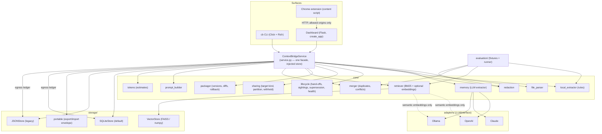

# Architecture

ContextBridge treats conversational context as **data with a schema** rather than a blob of chat history. This document describes the moving parts, the data model, and the decisions behind them.

## Overview



### Layers

| Layer | Responsibility | Key rule |
|---|---|---|
| **Surfaces** (`cli.py`, `web/app.py`, `extension/`) | Parse input, render output | No business logic; everything goes through the service |
| **Service** (`service.py`) | Orchestrates extraction → redaction → packaging → storage → retrieval → prompt | Takes the store and settings by injection; no module-level state |
| **Core** (`core/`) | Pure domain logic | No I/O except through the adapter interface; deterministic where possible |
| **Adapters** (`adapters/`) | Vendor SDK calls | Implement `LLMInterface`; declare whether embeddings are semantic |
| **Storage** (`storage/`) | Persistence | Validate names before touching disk; never delete history |

The web app is created by `create_app(settings, store=..., service=...)`, and the CLI builds a per-invocation `Context`. Tests inject a temporary SQLite store and a mock adapter, so the full workflow runs without network access.

## Data model

All models live in `models.py` (Pydantic v2).

```
ContextPackage
├── name, version, schema_version, source_model, created_at, updated_at
├── memory: StructuredMemory
│   ├── identity:    [MemoryItem]
│   ├── projects:    [MemoryItem]
│   ├── facts:       [MemoryItem]
│   ├── decisions:   [MemoryItem]
│   ├── open_tasks:  [MemoryItem]
│   └── preferences: [MemoryItem]
├── history: [ContextVersion{version, timestamp, diff{added, removed, modified}, source_model, note}]
└── metadata: {}   # merged_from, merge_report, pending_conflicts, handoffs

MemoryItem
├── id             # sha1(category + normalised content)[:12] — stable across re-extraction
├── category, content, confidence (0–1)
├── source         # excerpt from the conversation that supports the item
├── origin         # provenance: file name(s), chat title, or package name(s), joined with " | "
├── redactions     # [{kind, count}] — what was masked, never the value
├── sharing        # any | local_only | never — who may see it in a prompt
├── status         # active | superseded | done — only active items are rendered / retrieved
├── superseded_by  # id of the replacement when status == superseded
└── first_seen, last_seen, seen_count   # corroboration: how often and how recently it was re-stated

EgressRecord (ledger, stored beside the package, never inside the payload)
├── id, timestamp, package_name, package_version
├── target_model, target_kind (cloud | local), surface (cli | dashboard | extension | query)
├── query          # the retrieval query, if any (first 200 chars)
└── item_ids, item_count, withheld_count, tokens
```

**Why content-derived ids.** Diffs, merges, review removals, and evaluation all need to refer to "the same statement" across runs. Hashing the normalised content (plus category) gives a stable handle without a registry, and makes exact duplicates trivially detectable.

**Schema versions.** Packages written by 0.1.x lack `id`, `origin`, `redactions`, and `schema_version`; 0.2.x packages lack `sharing`, `status`, `superseded_by`, and the sighting fields. Every new field has a default, and ids are computed in a model validator, so old files load unchanged and are upgraded the next time they are saved.

### Version history

`ContextVersion.version` is the version the entry *produced* (v1 = "created", v2 = first update, ...). Rollback walks history backwards, removing the `added` items, restoring the `removed` ones, and re-applying the `before` values of `modified` entries. `modified` covers the tracked fields `status`, `superseded_by`, and `sharing` (`TRACKED_ITEM_FIELDS`); because items are matched by id, reordering or whitespace changes never register as edits, and content changes show up as remove + add.

## Sharing boundaries

`core/sharing.py` answers one question before any prompt is rendered: *may this target see this item?*

1. `classify_target(name)` maps the target to `local` (Ollama-style names) or `cloud`. Anything unrecognised is `cloud` — the conservative default.
2. `partition_for_target(memory, target)` splits the memory into the allowed subset and a list of `WithheldItem{item, reason}`. Items are withheld when they are superseded or done, when their policy is `never`, or when their policy is `local_only` and the target is cloud.
3. The service retrieves and renders only the allowed subset, so a withheld item can neither be selected by a query nor leak through the "full package" footer counts. The withheld list is returned to every surface and the count is stamped into the prompt footer.

Policies are plain item fields, so they travel with portable exports and merges, and changing one is a versioned, reversible package update.

## Egress ledger

Every prompt build (`ContextBridgeService.build_prompt`) and every `cb query` context (`system_prompt_for_query`) appends an `EgressRecord` through `StorageBackend.record_egress`. SQLite stores it in the `egress_log` table; the JSON backend appends a line to `<package>/egress.jsonl`; the in-memory default on the base class exists for ad-hoc backends and tests. Records hold item **ids**, not text, so the ledger does not become a second copy of the memory. `build_prompt(record=False)` (CLI `--dry-run`, dashboard checkbox) previews without writing. `audit()` folds the ledger into a per-item view (targets, counts, whether a cloud target was ever involved, whether the item still exists), and `health()` uses it to report exposure.

## Lifecycle

`core/lifecycle.py` keeps memory true over time without deleting anything:

* **Sightings.** `absorb(existing, incoming)` is what `ContextPackager.append` now uses: an incoming item whose id already exists bumps `seen_count` and `last_seen` and merges origins instead of being dropped; its status and sharing policy are preserved, so a restated-but-superseded decision stays superseded.
* **Supersession.** `supersede(memory, old, new)` marks `old` as `superseded` with `superseded_by = new`. Chains that end in another superseded item are refused. `set_status` handles `done` and reactivation (which clears the pointer).
* **Pending conflicts.** On append, `find_pending_conflicts` runs `PackageMerger.cross_conflicts(stored.active(), incoming)` — the merger's conflict test, restricted to stored-vs-new pairs and skipping re-sightings — and the service stores the results under `metadata.pending_conflicts`. They are pruned automatically when either item is removed or leaves the active state, and settled by `resolve_conflict` (`keep_new`, `keep_old`, `dismiss`).
* **Hand-offs.** `detect_handoff(text)` looks for the provenance footer that every ContextBridge prompt carries (`Context: "<name>" v<N>`). When the surrounding paste wrapper is present, the whole block is cut before extraction; the `Handoff` (source package, version, stripped length, origin) is appended to `metadata.handoffs`.
* **Health.** `health_report` combines status counts, sightings, staleness (`last_seen` older than `stale_days`), open tasks, pending conflicts, and the egress ledger into one dictionary used by `cb health` and the dashboard.

## Storage

### SQLite (default)

`storage/sqlite_store.py` keeps one database file, `contextbridge.db`, in the storage directory:

| Table | Purpose |
|---|---|
| `packages` | One summary row per package (current version, item count, timestamps). Listings never deserialise payloads. |
| `package_versions` | Full JSON payload of every saved version, keyed by `(name, version)`. Identical to the portable format, so export and rollback are trivial. |
| `egress_log` | One row per prompt build / query: target, kind, surface, query, item ids (JSON), counts, tokens. Deleted with the package. |

Writes are transactional and guarded by a lock so the Flask dev server's threads cannot interleave. WAL mode is enabled. `PRAGMA user_version` is 2; the `egress_log` table is created with `IF NOT EXISTS`, so opening a 0.2 database upgrades it in place.

### JSON (legacy, still supported)

`storage/json_store.py` writes `context_vN.json` files plus a `latest.json` copy per package, and `egress.jsonl` (one ledger record per line) beside them. It is kept for backward compatibility and because the files are easy to inspect by hand. Writes are atomic (temp file + rename); ledger lines are appended, and a torn last line is skipped on read.

### Migration

`get_store()` picks the backend from `CB_STORAGE_BACKEND` (default `sqlite`). When SQLite is used, any legacy JSON package found in the storage directory that is not yet in the database is imported (all versions), and the JSON files are left in place. `cb migrate` runs the same routine explicitly and reports what happened.

### Portable packages

`storage/portable.py` wraps a package in a small envelope (`format`, `schema_version`, `exported_at`, `package`). Import accepts the envelope or a bare legacy package document, enforces a size limit, validates the name, and refuses to overwrite unless asked.

## Retrieval

`core/retriever.py` scores every item and returns a `RetrievalResult` that the UI can explain:

1. **Lexical scorer (always on).** BM25 over item content and source excerpt, with a small conservative stemmer and a stop-word list. Scores are normalised against the ceiling a document would reach if every query term were saturated, so `1.0` means "all query terms strongly present" and scores are comparable across queries. Matched terms are recorded per item.
2. **Embedding scorer (optional).** If the adapter sets `semantic_embeddings = True` (OpenAI, Ollama embedding models) and a `VectorStore` is provided, cosine similarity is blended in with weight 0.5. Claude's hash-based fallback is flagged non-semantic and ignored, so noise never outranks real matches. Any embedding failure degrades to lexical only.
3. **Selection.** Candidates are filtered by category and by status (superseded / done items are skipped unless `include_inactive` is set, and counted in `excluded_inactive`), sorted by score (ties: confidence, category order, id), pruned by `min_score`, capped at `top_k`, and packed greedily under an optional `token_budget`. Items with zero evidence are never selected. Counters record what was dropped and why. When retrieval runs as part of a prompt build, it only ever sees the subset the sharing boundary allowed.
4. **Token accounting.** `core/tokens.py` estimates tokens (≈4 chars/token blended with a word count). The result reports tokens in the selection, in the full memory, and in the source transcript when known.

## Redaction

`core/redaction.py` runs a prioritised list of regex detectors (private keys, API keys, JWTs, credential assignments, credential URLs, card numbers with a Luhn check, SSNs, emails, phones, IP addresses). Overlaps are resolved by priority. Each masked span becomes `[REDACTED:KIND]` and the item records `{kind, count}`. The item id is recomputed after redaction. Policies can disable redaction or restrict it to certain kinds.

## Merging

`core/merger.py` folds near-duplicates within each category using a blend of token Jaccard and character ratio (threshold 0.82). The most confident, longest phrasing is kept and all origins are joined (`chat_a | chat_b`). Pairs in conflict-prone categories with similarity between 0.45 and 0.82 that share at least two terms are flagged as *possible conflicts* and both are kept. The threshold is deliberately high: a false negative leaves two items for the user to read, a false positive silently loses information. The same pair test is exposed as `cross_conflicts(stored, incoming)`, which the import path uses to flag contradictions between what is stored and what just arrived.

## Prompt building

`core/prompt_builder.py` renders memory as XML (Claude), Markdown (ChatGPT), or plain numbered text (local models), adds a provenance footer (package, version, item counts, retrieval method, withheld count), and wraps it in the paste-ready message used by the dashboard and extension. Attached files are included only when explicitly requested. The footer doubles as the hand-off marker that `lifecycle.detect_handoff` recognises on re-import.

## Security posture of the local server

* Binds to `127.0.0.1` by default.
* CORS is restricted to the chat sites the extension runs on (`CB_ALLOWED_ORIGINS`).
* Package names must match `^[A-Za-z0-9][A-Za-z0-9_.\-]{0,63}$`; upload file names are sanitised and restricted to known extensions; uploads are capped (`CB_MAX_UPLOAD_MB`).
* Unexpected exceptions return a generic message; details go to the server log. Memory content, transcripts, and API keys are never logged.

## Evaluation

`evaluation/` ships JSON fixtures (three labelled transcripts, duplicate pairs, redaction samples) and a runner that computes extraction coverage, retrieval precision/recall/MRR, duplicate F1, redaction recall and false positives, and token savings. See [EVALUATION.md](EVALUATION.md).

## Extending

* **New adapter:** subclass `LLMInterface`, set `semantic_embeddings`, register in `adapters/get_adapter`.
* **New storage backend:** subclass `StorageBackend`, validate names, add to `storage/get_store`. Override `record_egress` / `egress_records` / `clear_egress` if the ledger should persist (the base class keeps it in memory).
* **New target kind:** extend `sharing.LOCAL_TARGET_MARKERS` if a new local runtime's model names are not recognised; unknown names are treated as cloud on purpose.
* **New detector:** append a `Detector` to `redaction.DETECTORS` and a sample to `evaluation/fixtures/redaction.json`.
* **New fixture:** add a transcript JSON under `evaluation/fixtures/` and list it in `index.json`.
